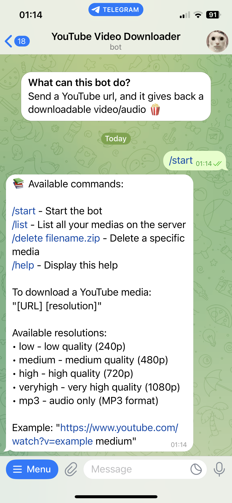

# YouTube Downloader for Telegram

A Telegram bot powered by AWS Lambda that allows users to download YouTube videos in different qualities, download audio from YouTube videos in MP3 format, and send them directly via Telegram or through a presigned S3 download link for larger files.



## 🌟 Features

- Download YouTube videos in 4 different resolutions (240p, 480p, 720p, 1080p)
- Download audio from YouTube videos in MP3 format
- Direct sending of videos/audio under 50 MB via Telegram
- Automatic storage on AWS S3 and generation of presigned links for files over 50 MB
- YouTube cookies management to access age-restricted content
- Commands to list and delete stored videos/audios
- Message history tracking in AWS DynamoDB for user activity monitoring
- An alert through CloudWatch (and mail via SNS if you want) notifies you when yt-dlp cannot download a video/audio from YouTube and needs to be updated

## 📋 Available Commands

- `/start` - Start the bot
- `/list` - List all the videos/audios stored in the S3 bucket
- `/delete filename.zip` - Delete a specific video/audio from the S3 bucket
- `/history` - Show the messages history (hidden by default in the Telegram user interface)
- `/help` - Display help with all available commands

To download a video/audio, simply send:
```
[YouTube URL] [resolution]
```

## 🎥 Available resolutions and formats:

- `low` (240p)
- `medium` (480p)
- `high` (720p)
- `veryhigh` (1080p)
- `mp3` (audio only)

## 📝 Examples:

For video:
```
https://www.youtube.com/watch?v=example medium
```

For audio only:
```
https://www.youtube.com/watch?v=example mp3
```

## 🏗️ Architecture

The bot is built with:
- AWS Lambda for code execution
- AWS Lambda layers for yt-dlp and FFmpeg
- AWS S3 for:
  - Video/audio files storage
  - Cookies storage
- AWS DynamoDB for storing user message history and interactions
- AWS Secrets Manager for securely managing the Telegram bot token
- AWS API Gateway for the Telegram webhook
- AWS IAM for managing permissions

## 🔧 Prerequisites

- An AWS account
- A Telegram bot (created via @BotFather)

## 🚀 Deployment

### 👷 Lambda function

Create an AWS Lambda function and upload the code from `lambda_function.py` (Adapt the GLOBAL VARIABLES in the beginning of the file)

### 🛠️ Add layers containing yt-dlp and FFmpeg

To create a Lambda layer for yt-dlp, follow these steps:

1. Create a new directory for the layer:
   ```bash
   mkdir -p yt-dlp-layer/bin && cd yt-dlp-layer
   ```

3. Download `yt-dlp`:
   ```bash
   curl -L https://github.com/yt-dlp/yt-dlp/releases/latest/download/yt-dlp -o bin/yt-dlp
   ```

4. Make the downloaded file executable:
   ```bash
   chmod +x bin/yt-dlp
   ```

5. Zip the layer:
   ```bash
   zip -r yt-dlp-layer.zip bin
   ```

6. Upload the zip file to Lambda as a new layer and assign it to your Lambda function.

To create a Lambda layer for FFmpeg, follow these steps:

1. Download the latest version of FFmpeg binary files:
    ```bash
    wget https://johnvansickle.com/ffmpeg/releases/ffmpeg-release-amd64-static.tar.xz
    ```

2. Extract the downloaded file:
   ```bash
   tar xvf ffmpeg-release-amd64-static.tar.xz
   ```

3. Copy the contents of the extracted FFmpeg folder into a “ffmpeg/bin/” directory. Be careful to use the correct version in the command below, yours might be different from the 6.1 used in this example:
    ```bash
    mkdir -p ffmpeg/bin && cp ffmpeg-6.1-amd64-static/ffmpeg ffmpeg/bin/
    ```
   
4. Zip the layer:
    ```bash
    zip -r ffmpeg.zip ffmpeg/bin
    ```
5. Upload the zip file to Lambda as a new layer and assign it to your Lambda function.

Note that when creating a layer, you need to select "Compatible runtimes" as your python version you are using across your AWS services for this project.

Always make sure to use the latest version of yt-dlp, as YouTube often changes its API and yt-dlp needs to be updated to work properly. Same goes for FFmpeg but necessary updates are less frequent.
To be alerted whenever yt-dlp needs to be updated, you can create another Lambda function from the file 'lambda_function_monitor_yt-dlp.py' and schedule it to run daily using AWS EventBridge.
You can set up an alarm with CloudWatch whenever it fails, and configure it to be notified with SNS about the need to update yt-dlp. Don't forget to give the necessary S3 permissions "s3:GetObject" to get your cookies file.


### 🌐 API Gateway

1. Create a new HTTP API
2. Add a new integration with your Lambda function
3. Choose "Method" as ANY for simplicity, the "Resource path" like "/my_api", and "Integration target" as your Lambda function name
4. Keep Stage name as "$default" and "Auto-deployed" selected
5. Get webhook info by using this url https://api.telegram.org/bot<BOT_TOKEN>/getWebhookInfo
6. Add webhook by using this url https://api.telegram.org/bot<BOT_TOKEN>/setWebhook?url=<API_GATEWAY_URL>
7. (Optional) Delete webhook by using this url https://api.telegram.org/bot<BOT_TOKEN>/deleteWebhook

### 🪣 S3 bucket for Cookies and stored YouTube videos

You'll need two S3 buckets:
1. A bucket for YouTube cookies (needed for yt-dlp to work)
2. A bucket for storing downloaded videos that are larger than 50MB

For the cookies bucket (Yt-dlp sometimes needs cookies to work):

1. Export your YouTube cookies with a Chrome extention like "Get cookies.txt LOCALLY"
2. Create a new S3 bucket to store the cookies file
3. Upload the YouTube cookies .txt file to the bucket
4. Adapt the `lambda_function.py` file to use the bucket name and file key (i.e. the path in the bucket)

### 📊 DynamoDB Table for Message History

Create a new DynamoDB table:
- Table name: `telegram_messages`
- Partition key: `chat_id` (String)
- Sort key: `timestamp` (String)

### 🛡️ IAM Permissions

Configure IAM permissions to access S3, Secrets Manager, Lambda, DynamoDB and CloudWatch. You can do it in the Lambda function Configuration > Permissions > Click on the Role name > Add permissions > Create inline policy > Add the required permissions.

The S3 policy looks like this:
```json
{
	"Version": "2012-10-17",
	"Statement": [
		{
			"Sid": "S3DLVideosBucket",
			"Effect": "Allow",
			"Action": "s3:ListBucket",
			"Resource": "arn:aws:s3:::yt-downloaded-videos"
		},
		{
			"Sid": "S3DLVideosBucketObjectAccess",
			"Effect": "Allow",
			"Action": [
				"s3:PutObject",
				"s3:GetObject",
				"s3:DeleteObject"
			],
			"Resource": [
				"arn:aws:s3:::yt-downloaded-videos/*"
			]
		},
		{
			"Sid": "S3CookiesBucketObjectAccess",
			"Effect": "Allow",
			"Action": [
				"s3:GetObject"
			],
			"Resource": [
				"arn:aws:s3:::yt-cookies/youtube_cookies.txt"
			]
		},
		{
			"Sid": "S3MessageHistoryBucket",
			"Effect": "Allow",
			"Action": "s3:ListBucket",
			"Resource": "arn:aws:s3:::yt-user-message-history"
		},
		{
			"Sid": "S3MessageHistoryBucketObjectAccess",
			"Effect": "Allow",
			"Action": [
				"s3:PutObject",
				"s3:GetObject"
			],
			"Resource": [
				"arn:aws:s3:::yt-user-message-history/*"
			]
		}
	]
}
```

The Secrets Manager policy looks like this:
```json
{
	"Version": "2012-10-17",
	"Statement": [
		{
			"Sid": "SecretManagerAccess",
			"Effect": "Allow",
			"Action": "secretsmanager:GetSecretValue",
			"Resource": "arn:aws:secretsmanager:*:*:secret:Telegram-bot-token-*"
		}
	]
}
```

The Lambda policy (for the Lambda function to be able to invoke itself) looks like this:
```json
{
    "Version": "2012-10-17",
    "Statement": [
        {
            "Sid": "VisualEditor0",
            "Effect": "Allow",
            "Action": "lambda:InvokeFunction",
            "Resource": "arn:aws:lambda:{aws_region}:{aws_account_id}:function:yt_dl_bot_lambda_function"
        }
    ]
}
```

The DynamoDB policy looks like this:
```json
{
    "Version": "2012-10-17",
    "Statement": [
        {
            "Effect": "Allow",
            "Action": [
                "dynamodb:PutItem",
                "dynamodb:Query",
                "dynamodb:Scan"
            ],
            "Resource": "arn:aws:dynamodb:*:*:table/telegram_messages"
        }
    ]
}
```

The CloudWatch policy looks like this:
```json
{
    "Version": "2012-10-17",
    "Statement": [
        {
            "Sid": "VisualEditor0",
            "Effect": "Allow",
            "Action": "cloudwatch:PutMetricData",
            "Resource": "*"
        }
    ]
}
```

## 💸 Pricing

Using this bot is extremely cost-effective for personal use.
For a few downloads per month (typical user pattern), the AWS services used will cost approximately 0.01€ per month.

## 📝 Notes

- Files larger than 50MB are automatically stored on S3 and shared via a presigned link, because Telegram API has a file size limit of 50MB
- Message history is stored in DynamoDB and can be accessed using the `/history` command, even though it's hidden to the user by default in the help message
- Debug using CloudWatch Log groups and Lambda function logs located in the Monitoring tab
